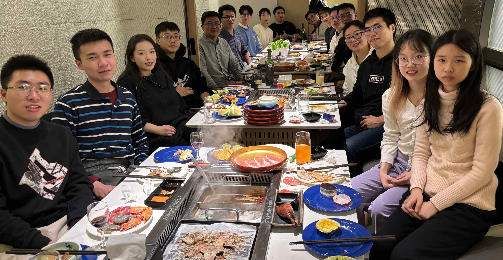
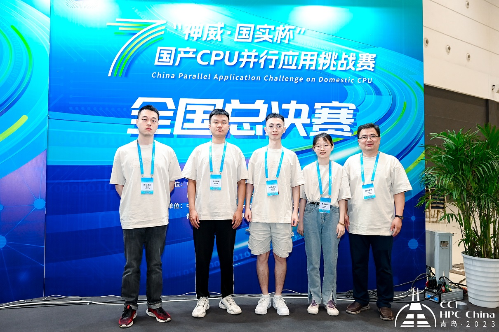
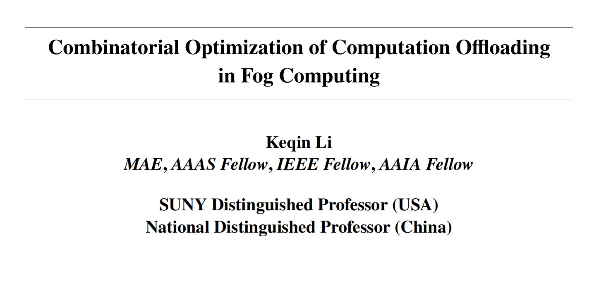
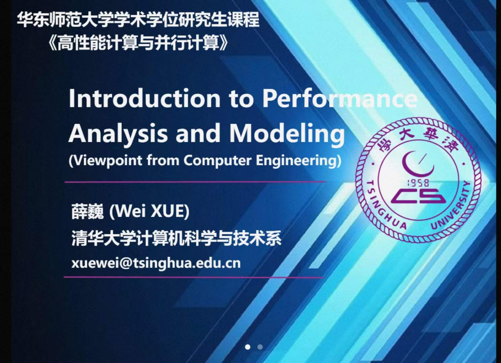
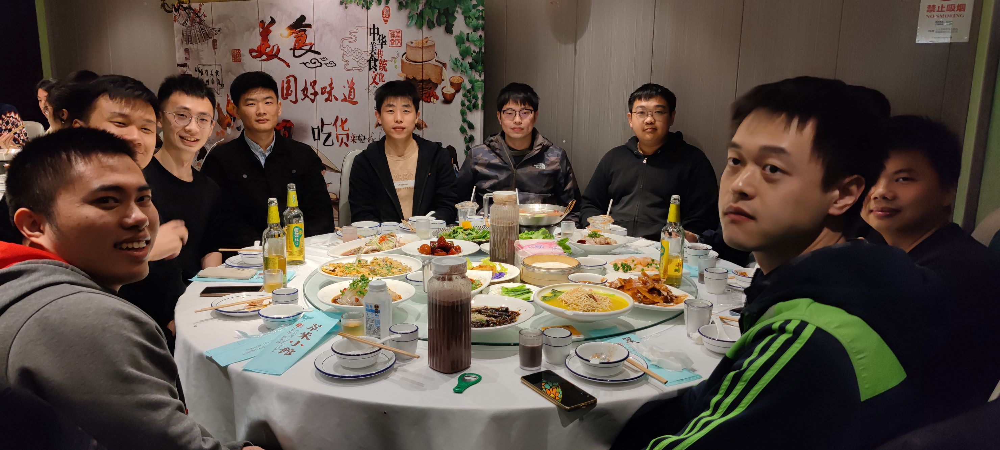
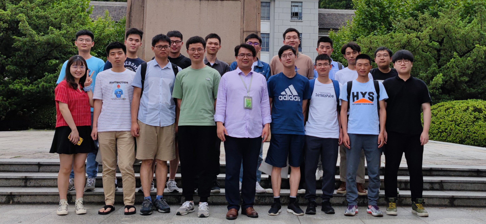
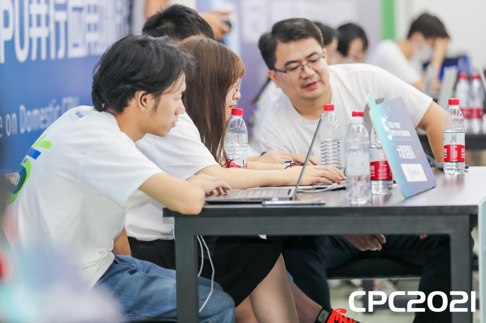

 
 

<h2>2023秋实验室聚餐</h2>

 

<a href="photos/20231118.html"  style='float:right; text-align: right;'>\>>>活动详情</a>

 
 

<h2>第七届“神威杯”国产CPU并行应用挑战赛总决赛</h2>

 

<a href="photos/20230827.html"  style='float:right; text-align: right;'>\>>>活动详情</a>

 
 

<h2>学术报告 | 雾计算中计算迁移的组合优化</h2>

 

<a href="photos/20230626.html"  style='float:right; text-align: right;'>\>>>活动详情</a>

 
 

<h2>学术报告 | 并行程序的性能分析与建模</h2>

 

<a href="photos/20230518.html"  style='float:right; text-align: right;'>\>>>活动详情</a>

 
 

<h2>2023年春实验室聚餐</h2>

 

<a href="photos/20230326.html"  style='float:right; text-align: right;'>\>>>活动详情</a>

 
 

<h2>2021年春实验室全体成员研讨&团建</h2>

 

<a href="photos/20210620.html"  style='float:right; text-align: right;'>\>>>活动详情</a>

 
 

<h2>第五届“神威杯”国产CPU并行应用挑战赛总决赛</h2>

 

<a href="photos/20211001.html"  style='float:right; text-align: right;'>\>>>活动详情</a>

 
 
 

