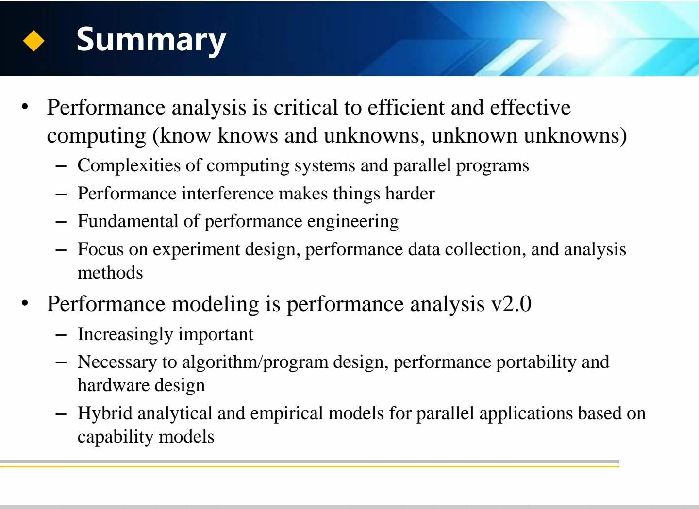
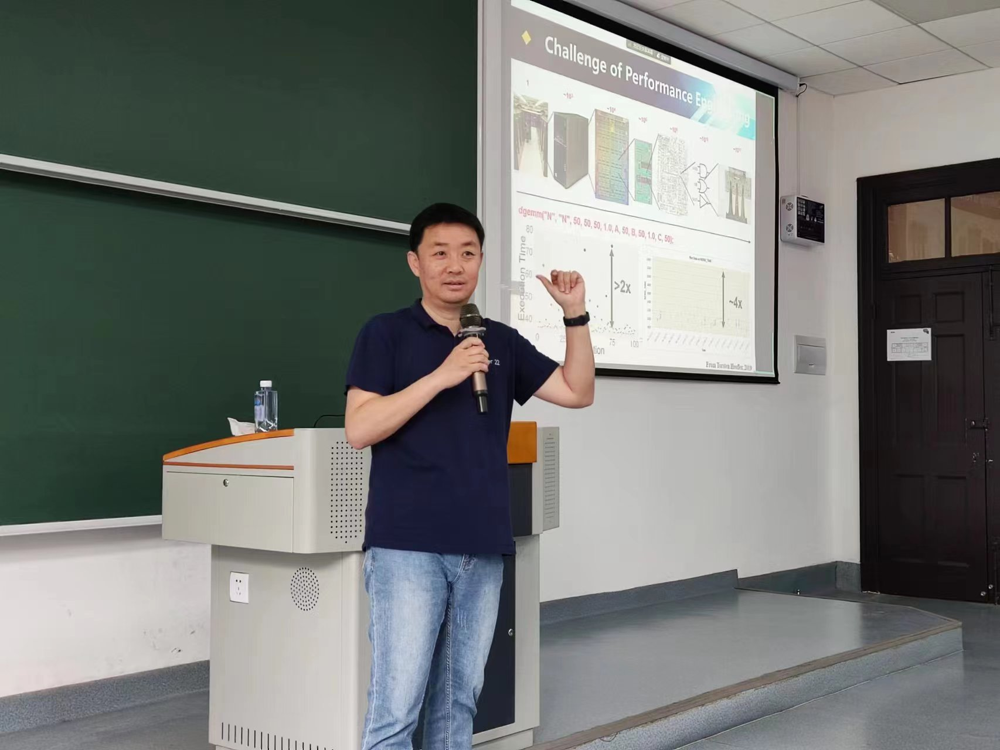
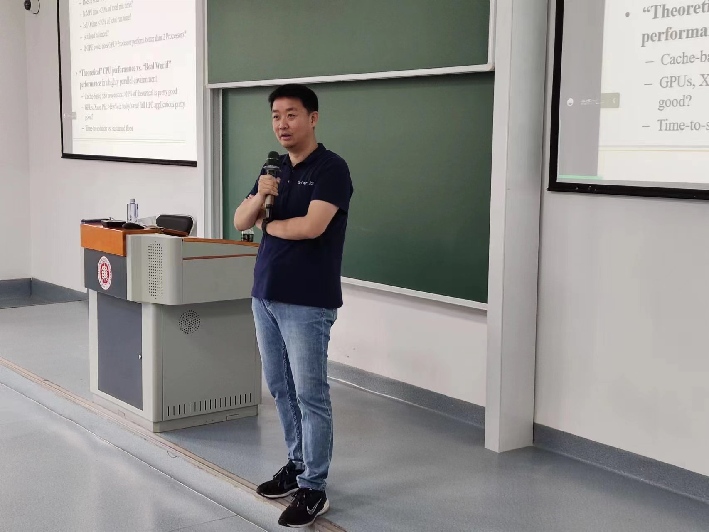
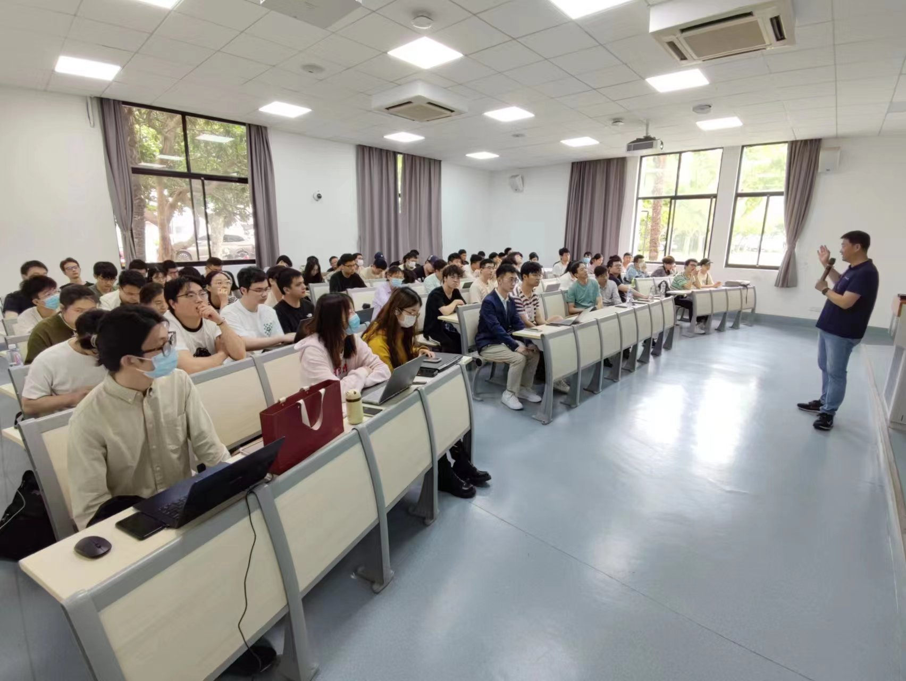

 

<h2>学术报告 | 并行程序的性能分析与建模</h2>

 

<strong>图：学术报告介绍</strong>

 

<strong>图：学术报告1</strong>

 

<strong>图：学术报告2</strong>

 

<strong>图：学术报告现场1</strong>

 

<strong>图：学术报告现场2</strong>

 

<strong>图：学术报告现场3</strong>

 

 
 
 