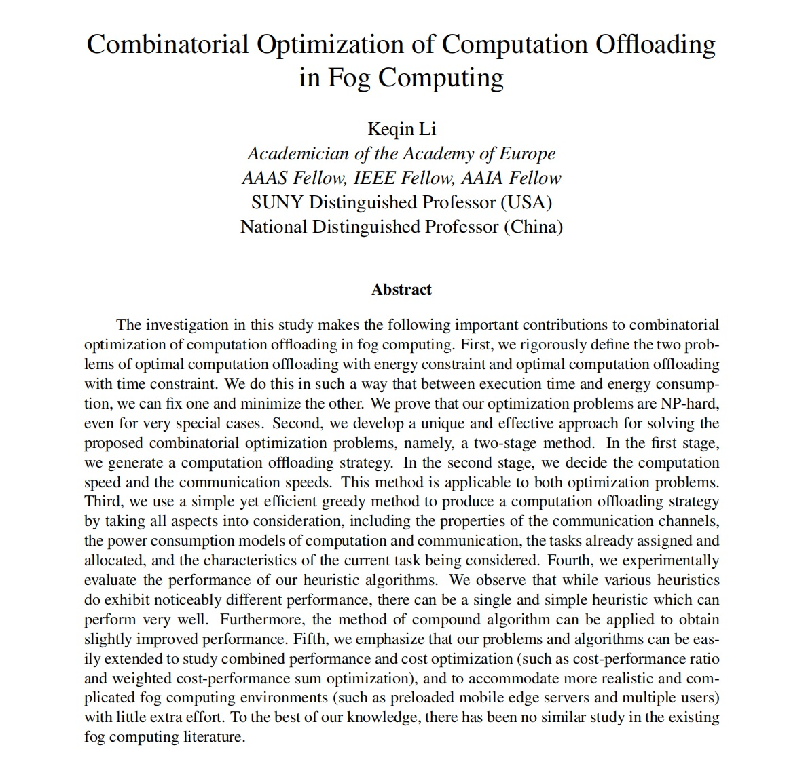
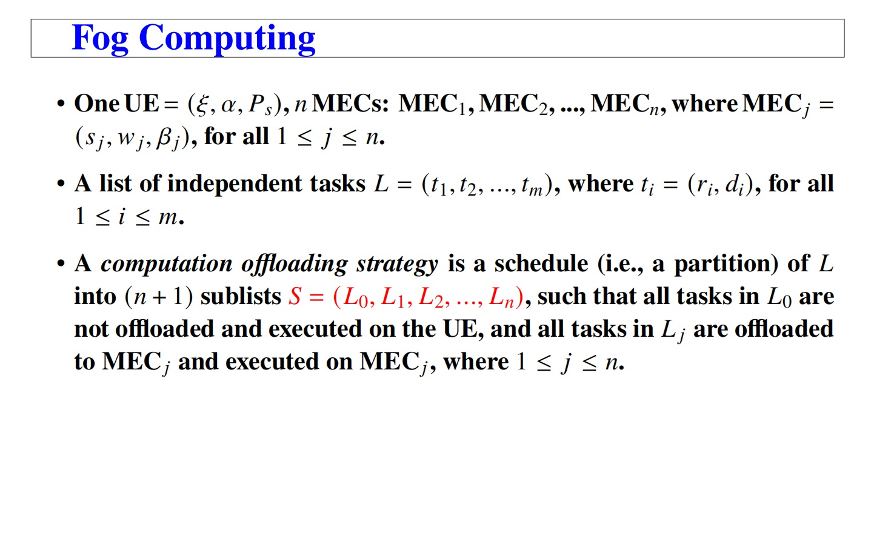
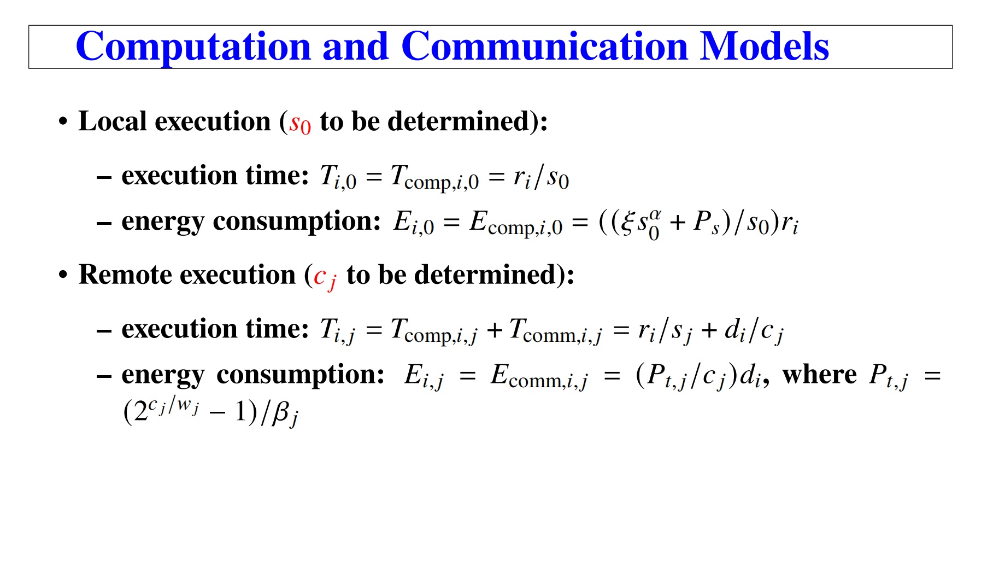
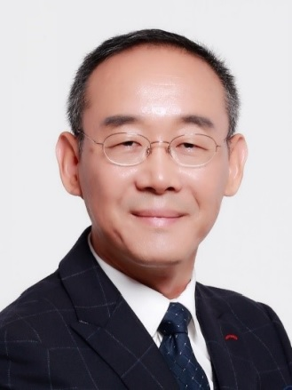
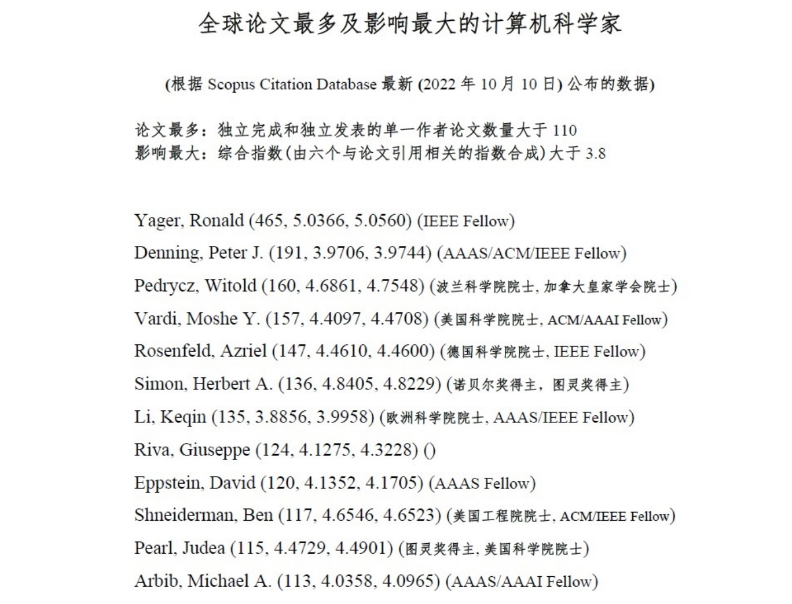

 

<h2>学术报告 | 雾计算中计算迁移的组合优化</h2>

 

 

<strong>图：学术报告摘要</strong>

 

 

<strong>图：学术报告1</strong>

 

 

<strong>图：学术报告2</strong>

 

 

 
 
 

<strong>李克勤教授简介</strong>

 

 

李克勤现为纽约州立大学终身讲席教授、湖南大学信息科学与工程学院国家特聘教授。1985年毕业于清华大学，获计算机科学学士学位；1990年毕业于美国休斯顿大学，获计算机科学博士学位。先后在纽约州立大学担任助理教授(1990)、副教授(1996)、正教授(1999)；2009年晋升为讲席教授并获得杰出教授奖章；2011年被聘为清华大学信息科学与技术国家实验室高智讲座教授；2012年当选纽约州立大学杰出学院院士，并成为国家“千人计划”特聘教授；2014年聘为国防科技大学协同创新中心兼职教授；2015年当选国际电气和电子工程师协会会士IEEE Fellow；2016年荣获中共中央组织部和国家人力资源和社会保障部联合任命的“国家特聘专家”称号(中华人民共和国海外高层次引进人才最高荣誉称号)；2022年当选欧洲人文和自然科学院(欧洲科学院)院士、美国科学促进会院士AAAS Fellow、亚太人工智能学会会士AAIA Fellow。他连续20多年荣登科学与工程名人录、美国名人录、世界名人录、美国教育界名人录，并于2017年荣膺Albert Nelson Marquis终身成就奖。他是2018 年清华大学计算机系六十周年系庆的杰出讲演者，并在2018年休斯顿大学计算机科学系五十周年系庆上荣获杰出校友奖。他在并行与分布式计算领域2020年度科学影响力排行榜上 雄居全美第一位和全球第三位，在并行与分布式计算领域2021年终身科学影响力排行榜上 雄居全美第三位和全球第四位(前五名中唯一的华人科学家)。他是国际上仅有的12位单作论文数量超过110篇以及综合影响指数大于3.8的计算机科学家之一。他2022年荣获IEEE云计算技术委员会最高奖项-研究影响力奖。他在学术著作、研究期刊、和国际会议上共发表论文900篇以上(其中SCI期刊论文超过620篇，IEEE和ACM Transactions和Journals论文超过260篇，CCF A类论文超过120篇)。他的论文发表在IEEE-TCC和IEEE-TSUSC的创刊号上。他的学术著作Scheduling Parallel Applications on Heterogeneous Distributed Systems《异构分布式系统中的并行应用调度》由国际顶尖的斯普林格(Springer)学术出版社于2019年9月出版。他的最新学术著作Workflow Scheduling on Computing Systems《计算系统上的工作流调度》 由CRC出版社于2022年8月出版。他曾荣获PDPTA-1996, NAECON-1997, IPDPS-2000, ISPA-2016, NPC-2019, ISPA-2019, CPSCom-2022等国际学术会议的最佳论文奖。他的论文被收录到许多国际学术会议的最佳论文集中，包括HPCS-1997, PMEO-PDS-2002, WMN-2003, PMEO-PDS-2004, IPDPS-2004, PMEO-2008, WWASN-2009, PMEO-2010, APDCM-2010, APDCM-2011, HPGC-2011, PMAM-2014。他拥有中国国家知识产权局公布或授权的70多项发明专利。他多次担任国际学术会议主席，包括第21届IEEE高性能计算和通信会议(2019)、IEEE超智能联合大会(2022, 含6个国际会议)、第9届IEEE边计算和可扩展云会议(2023)的主席。他主持国家自然科学基金委员会的重点项目“面向激光聚变模拟的大规模异构众核系统可扩展并行算法与优化方法”；主持国家自然科学基金委和新加坡国家研究基金会数据科学合作研究项目“面向列车故障检测的深度学习模型及其异构并行处理技术”；承担科技部863重大项目“高性能计算环境应用服务优化关键技术”和“基于内存计算的并行处理系统研究与开发”；并且主持科技部国家重点研发计划“面向异构体系结构的高性能分布式数据处理技术与系统”的子项目“面向大数据集的数据流编程模型及高通量视频示范应用”；同时在“大规模异构并行系统的高效能调度理论与方法”领域带领湖南省自然科学基金创新研究群体；他负责的科研经费达2252万元。他在全球120多个大学和研究所作过特邀学术报告。他是ACM Computing Surveys, IEEE Transactions on Parallel and Distributed Systems,IEEE Transactions on Computers, IEEE Transactions on Cloud Computing, IEEE Transactions on Services Computing, IEEE Transactions on Sustainable Computing等著名和顶级学术刊物的编委。他是IEEE计算机学会Fellow遴选和评审委员会委员(2015-2022)以及IEEE高级会员申请审查小组成员(2023)。

 

 
 
 